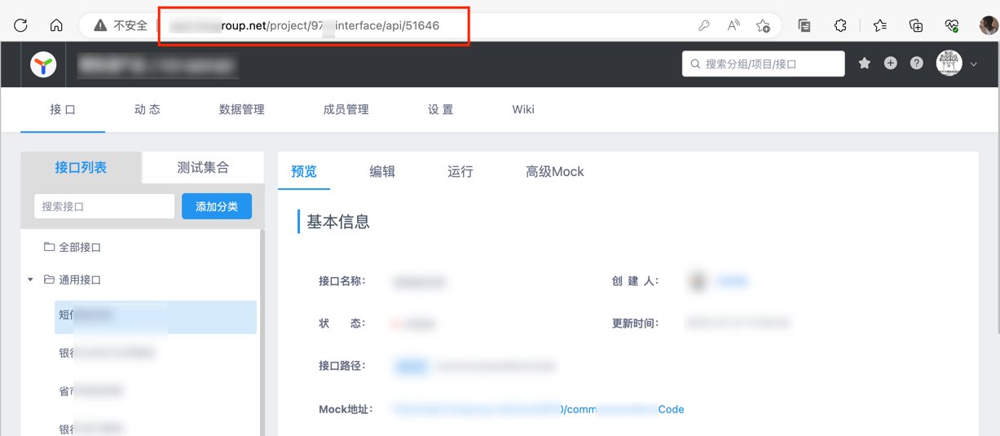
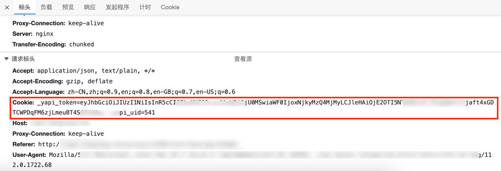
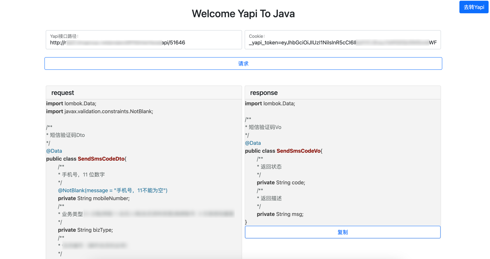
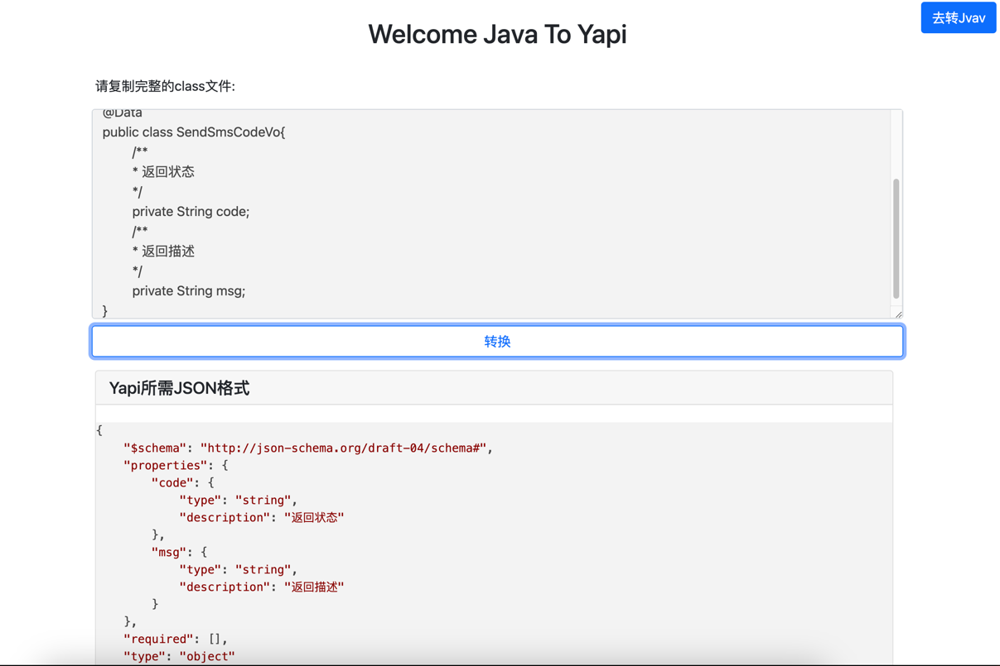
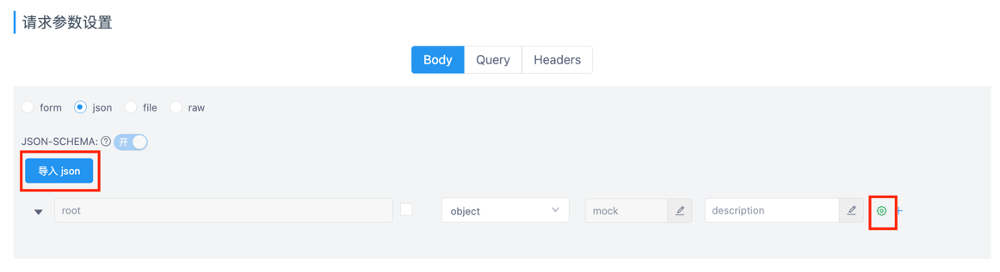
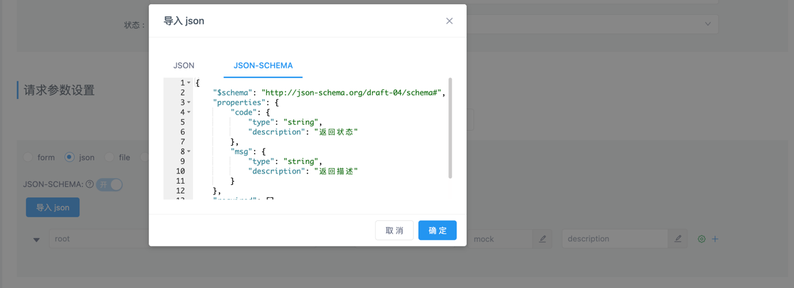
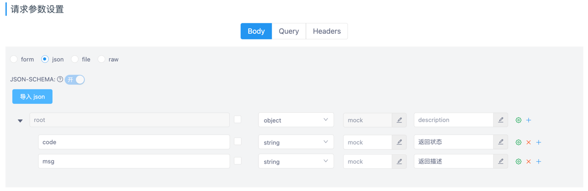

# YapiToJava
## 1、简介
### 一款支持"Yapi接口转Java实体"、"实体转Yapi所需的JsonSchema格式的"小工具。
## 2、快速使用
#### （1）Yapi接口转Java实体：

接口路径：
Cookie(打开F12随便一个Yapi接口中拿到):
把参数填写到页面中即可得到该接口定义的出参、入参。

#### （2）实体转Yapi：
把需要转换的实体Class文件复制粘贴到文本框中即可,转换好的Json复制

二选一(右边按钮所控制的粒度更细 推荐)

